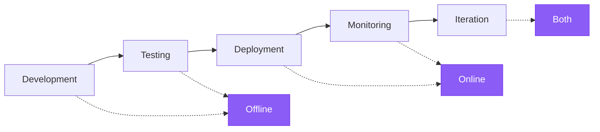

LLM outputs are non-deterministic, subjective quality often matters more than correctness, and real-world performance can diverge significantly from controlled tests. LangSmith Evaluation provides a framework for measuring quality throughout the application lifecycle, from pre-deployment testing to production monitoring.

<Callout icon="split" color="#8b5cf6" iconType="solid">
LangSmith supports two types of evaluations based on **what objects they run on**:

- <Icon icon="flask" iconType="solid" /> [Offline evaluations](#offline-evaluation) run on _examples_ from _datasets_. Examples include reference outputs for comparison. Use offline evaluations for pre-deployment testing, benchmarking, and regression testing.
- <Icon icon="radar" iconType="solid" /> [Online evaluations](#online-evaluation) run on _runs_ or _threads_ from [tracing](/langsmith/observability-quickstart) projects. These are real production traces without reference outputs. Use online evaluations for production monitoring and real-time performance tracking.

**The key distinction:** offline evaluations have access to reference outputs (what you expect), while online evaluations only have access to actual inputs and outputs (what actually happened).
</Callout>

## Evaluation lifecycle

As you develop and [deploy your application](/langsmith/deployments), your evaluation strategy evolves from pre-deployment testing to production monitoring. LLM applications progress through distinct phases, each requiring different evaluation approaches. During development and testing, offline evaluations validate functionality against curated datasets. After deployment, online evaluations monitor production behavior on live traffic. As applications mature, both evaluation types work together in an iterative feedback loop to improve quality continuously.

### 1. Development with offline evaluation

Before production deployment, use offline evaluations to validate functionality, benchmark different approaches, and build confidence.

1. Create a [dataset](/langsmith/manage-datasets) with representative test cases.
1. Run [offline evaluations](/langsmith/evaluate-llm-application) to measure performance.
1. Iterate on your application based on results.
1. Compare experiments to find the best configuration.

Follow the [quickstart](/langsmith/evaluation-quickstart) to run your first offline evaluation.

### 2. Initial deployment with online evaluation

After deployment, use online evaluations to monitor production quality, detect unexpected issues, and collect real-world data.

1. Set up [online evaluators](/langsmith/online-evaluations) in your tracing project.
1. Start with basic checks (e.g., no errors, response format validation).
1. Configure [alerts](/langsmith/alerts) for critical quality metrics.
1. Review traces that fail online evaluations.

Learn how to [configure online evaluations](/langsmith/online-evaluations) for production monitoring.

### 3. Continuous improvement

Use both evaluation types together in an iterative feedback loop. Online evaluations surface issues that become offline test cases, offline evaluations validate fixes, and online evaluations confirm production improvements.

1. Online evaluations detect an issue in production.
1. Add the failing trace to a dataset as a [new example](/langsmith/manage-datasets-in-application#add-runs-to-a-dataset).
1. Reproduce and fix the issue locally.
1. Run offline evaluation to verify the fix.
1. Deploy the updated application.
1. Confirm the fix with online evaluations.

## Core evaluation objects

Evaluations run on different objects depending on whether they are offline or online. Understanding these objects is essential for choosing the right evaluation approach.

### Objects for offline evaluation

Offline evaluations run on datasets and examples. The presence of reference outputs enables comparison between expected and actual results.

#### Datasets

A dataset is a _collection of examples_ used for evaluating an application. An example is a test input, reference output pair.

#### Examples

Each example consists of:

- **Inputs**: a dictionary of input variables to pass to your application.
- **Reference outputs** (optional): a dictionary of reference outputs. These do not get passed to your application, they are only used in evaluators.
- **Metadata** (optional): a dictionary of additional information that can be used to create filtered views of a dataset.

#### Dataset curation

There are various ways to build datasets for evaluation, including:

- [Manually curated examples](#manually-curated-examples)
- [Historical traces](#historical-traces)
- [Synthetic data](#synthetic-data)

#### Manually curated examples

This is the recommended starting point for creating datasets. When building an application, you'll have some idea of what types of inputs the application should handle, and what "good" responses should be. Start by covering a few different common edge cases or situations. Even 10–20 high-quality, manually curated examples can be sufficient for initial testing.

#### Historical traces

Once an application is in production, it collects valuable information about real-world usage patterns. These production runs make excellent examples because they reflect actual user behavior.

For high-traffic applications, several techniques help identify valuable runs to add to a dataset:

- **User feedback**: Collect end user feedback to identify datapoints that received negative feedback. These represent cases where the application did not perform well and should be added to the dataset to test against in the future.
- **Heuristics**: Use other heuristics to identify interesting datapoints. For example, runs that took a long time to complete are worth examining and potentially adding to a dataset.
- **LLM feedback**: Use another LLM to detect noteworthy runs. For example, an LLM can label chatbot conversations where the user had to rephrase their question or correct the model, indicating the chatbot did not initially respond correctly.

#### Synthetic data

_Synthetic data generation_ creates additional examples artificially from existing ones. This approach works best when starting with several high-quality, hand-crafted examples, because the synthetic data typically uses these as templates. This provides a quick way to expand dataset size.

#### Splits

_Splits_ are partitions of a dataset that enable targeted evaluation on different subsets of examples. Splits serve two primary purposes: performance optimization (using a smaller split for rapid iterations and a larger split for final evaluation) and interpretability (evaluating different types of inputs separately). For example, a RAG application might use splits to focus on different question types (factual, opinion, etc.) and evaluate performance on each type separately.

Learn how to [create and manage dataset splits](/langsmith/manage-datasets-in-application#create-and-manage-dataset-splits).

#### Versions

_Dataset versions_ track changes to datasets over time. When you add, update or delete an example, LangSmith creates a new [version](/langsmith/manage-datasets#version-a-dataset) automatically. This enables inspection and reversal of changes when needed. You can [tag](/langsmith/manage-datasets#tag-a-version) versions with human-readable names to mark important milestones in a dataset's history.

Evaluations can target specific dataset versions. This is particularly useful in CI pipelines to ensure dataset updates do not break existing evaluation workflows.

### Objects for online evaluation

Online evaluations run on runs and threads from production traffic. Without reference outputs, evaluators focus on detecting issues, anomalies, and quality degradation in real-time.

#### Runs

A _run_ is a single execution trace from your [deployed application](/langsmith/deployments). Each run contains:
- **Inputs**: The actual user inputs your application received.
- **Outputs**: What your application actually returned.
- **Intermediate steps**: All the child runs (tool calls, LLM calls, and so on).
- **Metadata**: Tags, user feedback, latency metrics, etc.

Unlike examples in datasets, runs do not include reference outputs. Online evaluators must assess quality without knowing what the "correct" answer should be, relying instead on quality heuristics, safety checks, and reference-free evaluation techniques.

Learn more about [runs and traces in the Observability concepts](/langsmith/observability-concepts#runs).

#### Threads

_Threads_ are collections of related runs representing multi-turn conversations. Online evaluators can run at the thread level to evaluate entire conversations rather than individual turns. This enables assessment of conversation-level properties like coherence across turns, topic maintenance, and user satisfaction throughout an interaction.

## Evaluators

_Evaluators_ are functions that score application performance. They provide the measurement layer for both offline and online evaluation, adapting their inputs based on what data is available.

### Defining and running evaluators

Evaluators can be defined and executed in multiple ways:

- **Custom code**: Define [custom evaluators](/langsmith/code-evaluator) as Python or TypeScript functions and run them client-side using the SDKs or server-side via the UI.
- **Built-in evaluators**: LangSmith provides built-in evaluators that can be configured and run via the UI.

Run evaluators using the LangSmith SDK ([Python](https://docs.smith.langchain.com/reference/python/reference) and [TypeScript](https://docs.smith.langchain.com/reference/js)), via the [Prompt Playground](/langsmith/observability-concepts#prompt-playground), or by configuring [rules](/langsmith/rules) to automatically run them on tracing projects or datasets.

### Evaluator inputs

Evaluator inputs differ based on evaluation type:

**Offline evaluators** receive:
- [Example](#examples): The example from your [dataset](#datasets), containing inputs, reference outputs, and metadata.
- [Run](/langsmith/observability-concepts#runs): The actual outputs and intermediate steps from running the application on the example inputs.

**Online evaluators** receive:
- [Run](/langsmith/observability-concepts#runs): The production trace containing inputs, outputs, and intermediate steps (no reference outputs available).

### Evaluator outputs

Evaluators return one or more metrics as a dictionary or list of dictionaries. Each dictionary contains:

- `key`: The metric name.
- `score` | `value`: The metric value (`score` for numerical metrics, `value` for categorical metrics).
- `comment` (optional): Additional reasoning or explanation for the score.

### Evaluation techniques

LangSmith supports several evaluation approaches:

- [Human](#human)
- [Heuristic](#heuristic)
- [LLM-as-judge](#llm-as-judge)
- [Pairwise](#pairwise)

#### Human

_Human evaluation_ involves manual review of application outputs and execution traces. This approach is [often an effective starting point for evaluation](https://hamel.dev/blog/posts/evals/#looking-at-your-traces). LangSmith provides tools to review application outputs and traces (all intermediate steps).

[Annotation queues](#annotation-queues) streamline the process of collecting human feedback on application outputs.

#### Heuristic

_Heuristic evaluators_ are deterministic, rule-based functions. They work well for simple checks such as verifying that a chatbot's response is not empty, that generated code compiles, or that a classification matches exactly.

#### LLM-as-judge

_LLM-as-judge evaluators_ use LLMs to score application outputs. The grading rules and criteria are typically encoded in the LLM prompt. These evaluators can be:

- **Reference-free**: Check if output contains offensive content or adheres to specific criteria.
- **Reference-based**: Compare output to a reference (e.g., check factual accuracy relative to the reference).

LLM-as-judge evaluators require careful review of scores and prompt tuning. Few-shot evaluators, which include examples of inputs, outputs, and expected grades in the grader prompt, often improve performance.

Learn about [how to define an LLM-as-a-judge evaluator](/langsmith/llm-as-judge).

#### Pairwise

_Pairwise evaluators_ compare outputs from two application versions using heuristics (e.g., which response is longer), LLMs (with pairwise prompts), or human reviewers.

Pairwise evaluation works well when directly scoring an output is difficult but comparing two outputs is straightforward. For example, in summarization tasks, choosing the more informative of two summaries is often easier than assigning an absolute score to a single summary.

Learn [how run pairwise evaluations](/langsmith/evaluate-pairwise).

### Reference-free vs reference-based evaluators

Understanding whether an evaluator requires reference outputs is essential for determining when it can be used.

**Reference-free evaluators** assess quality without comparing to expected outputs. These work for both offline and online evaluation:
- **Safety checks**: Toxicity detection, PII detection, content policy violations
- **Format validation**: JSON structure, required fields, schema compliance
- **Quality heuristics**: Response length, latency, specific keywords
- **Reference-free LLM-as-judge**: Clarity, coherence, helpfulness, tone

**Reference-based evaluators** require reference outputs and only work for offline evaluation:
- **Correctness**: Semantic similarity to reference answer
- **Factual accuracy**: Fact-checking against ground truth
- **Exact match**: Classification tasks with known labels
- **Reference-based LLM-as-judge**: Comparing output quality to a reference

When designing an evaluation strategy, reference-free evaluators provide consistency across both offline testing and online monitoring, while reference-based evaluators enable more precise correctness checks during development.

## Experiment

An _experiment_ represents the results of evaluating a specific application version on a dataset. Each experiment captures outputs, evaluator scores, and execution traces for every example in the dataset.

Multiple experiments typically run on a given dataset to test different application configurations (e.g., different prompts or LLMs). LangSmith displays all experiments associated with a dataset and supports [comparing multiple experiments](/langsmith/compare-experiment-results) side-by-side.

Learn [how to analyze experiment results](/langsmith/analyze-an-experiment).

## Experiment configuration

LangSmith supports several configuration options for experiments:

- [Repetitions](#repetitions)
- [Concurrency](#concurrency)
- [Caching](#caching)

### Repetitions

_Repetitions_ run an experiment multiple times to account for LLM output variability. Since LLM outputs are non-deterministic, multiple repetitions provide a more accurate performance estimate.

Configure repetitions by passing the `num_repetitions` argument to `evaluate` / `aevaluate` ([Python](https://docs.smith.langchain.com/reference/python/evaluation/langsmith.evaluation._runner.evaluate), [TypeScript](https://docs.smith.langchain.com/reference/js/interfaces/evaluation.EvaluateOptions#numrepetitions)). Each repetition re-runs both the target function and all evaluators.

Learn more in the [repetitions how-to guide](/langsmith/repetition).

### Concurrency

_Concurrency_ controls how many examples run simultaneously during an experiment. Configure it by passing the `max_concurrency` argument to `evaluate` / `aevaluate`. The semantics differ between the two functions:

#### `evaluate`

The `max_concurrency` argument specifies the maximum number of concurrent threads for running both the target function and evaluators.

#### `aevaluate`

The `max_concurrency` argument uses a semaphore to limit concurrent tasks. `aevaluate` creates a task for each example, where each task runs the target function and all evaluators for that example. The `max_concurrency` argument specifies the maximum number of concurrent examples to process.

### Caching

_Caching_ stores API call results to disk to speed up future experiments. Set the `LANGSMITH_TEST_CACHE` environment variable to a valid folder path with write access. Future experiments that make identical API calls will reuse cached results instead of making new requests.

## Offline evaluation

Offline evaluation tests applications on curated datasets before deployment. By running evaluations on examples with reference outputs, teams can compare versions, validate functionality, and build confidence before exposing changes to users.

Run offline evaluations client-side using the LangSmith SDK ([Python](https://docs.smith.langchain.com/reference/python/reference) and [TypeScript](https://docs.smith.langchain.com/reference/js)) or server-side via the [Prompt Playground](/langsmith/observability-concepts#prompt-playground) or [automations](/langsmith/rules).

### Benchmarking

_Benchmarking_ compares multiple application versions on a curated dataset to identify the best performer. This process involves creating a dataset of representative inputs, defining performance metrics, and testing each version.

Benchmarking requires dataset curation with gold-standard reference outputs and well-designed comparison metrics. Examples:
- **RAG Q&A bot**: Dataset of questions and reference answers, with an LLM-as-judge evaluator checking semantic equivalence between actual and reference answers
- **ReACT agent**: Dataset of user requests and reference tool calls, with a heuristic evaluator verifying all expected tool calls were made

### Unit tests

_Unit tests_ verify the correctness of individual system components. In LLM contexts, [unit tests are often rule-based assertions](https://hamel.dev/blog/posts/evals/#level-1-unit-tests) on inputs or outputs (e.g., verifying LLM-generated code compiles, JSON loads successfully) that validate basic functionality.

Unit tests typically expect consistent passing results, making them suitable for CI pipelines. When running in CI, configure caching to minimize LLM API calls and associated costs.

### Regression tests

_Regression tests_ measure performance consistency across application versions over time. They ensure new versions do not degrade performance on cases the current version handles correctly, and ideally demonstrate improvements over the baseline. These tests typically run when making updates expected to affect user experience (e.g., model or architecture changes).

LangSmith's comparison view highlights regressions (red) and improvements (green) relative to the baseline, enabling quick identification of changes.

### Backtesting

_Backtesting_ evaluates new application versions against historical production data. Production logs are converted into a dataset, then newer versions process these examples to assess performance on past, realistic user inputs.

This approach is commonly used for evaluating new model releases. For example, when a new model becomes available, test it on the most recent production runs and compare results to actual production outcomes.

### Pairwise evaluation

_Pairwise evaluation_ compares outputs from two versions by determining relative quality rather than assigning absolute scores. For some tasks, [determining "version A is better than B"](https://www.oreilly.com/radar/what-we-learned-from-a-year-of-building-with-llms-part-i/) is easier than scoring each version independently.

This approach proves particularly useful for LLM-as-judge evaluations on subjective tasks. For example, in summarization, determining "Which summary is clearer and more concise?" is often simpler than assigning numeric clarity scores.

Learn [how run pairwise evaluations](/langsmith/evaluate-pairwise).

## Online evaluation

Online evaluation assesses production application outputs in near real-time. Without reference outputs, these evaluations focus on detecting issues, monitoring quality trends, and identifying edge cases that inform future offline testing.

Online evaluators typically run server-side. LangSmith provides built-in [LLM-as-judge evaluators](/langsmith/llm-as-judge) for configuration, and supports custom code evaluators that run within LangSmith.

### Real-time monitoring

Monitor application quality continuously as users interact with the system. Online evaluations run automatically on production traffic, providing immediate feedback on each interaction. This enables detection of quality degradation, unusual patterns, or unexpected behaviors before they impact significant user populations.

### Anomaly detection

Identify outliers and edge cases that deviate from expected patterns. Online evaluators can flag runs with unusual characteristics—extremely long or short responses, unexpected error rates, or outputs that fail safety checks—for human review and potential addition to offline datasets.

### Production feedback loop

Use insights from production to improve offline evaluation. Online evaluations surface real-world issues and usage patterns that may not appear in curated datasets. Failed production runs become candidates for dataset examples, creating an iterative cycle where production experience continuously refines testing coverage.

## Human feedback mechanisms

Human feedback often provides the most valuable assessment of application quality, particularly for subjective dimensions that automated evaluators struggle to capture.

### Annotation queues

_Annotation queues_ enable structured collection of human feedback by organizing runs for review. [Annotation queues](/langsmith/annotation-queues) flag specific application runs for annotation. Annotators review these runs in a streamlined interface to provide feedback. Annotated runs can then be transferred to a [dataset](#datasets) for future evaluations.

Annotation queues complement [inline annotation](/langsmith/annotate-traces-inline) by offering additional capabilities: grouping runs together, specifying annotation criteria, and configuring reviewer permissions.

Learn more about [annotation queues and human feedback](/langsmith/annotation-queues).

## Testing

### Evaluations vs testing

Testing and evaluation are similar and overlapping concepts that are frequently conflated.

**Evaluation measures performance according to metrics.** Evaluation metrics can be fuzzy or subjective, and prove more useful in relative terms than absolute ones. They typically compare two systems against each other rather than assert properties about an individual system.

**Testing asserts correctness.** A system can only be deployed if it passes all tests.

Evaluation metrics can be converted into tests. For example, regression tests can assert that any new system version must outperform a baseline version on relevant evaluation metrics.

Running tests and evaluations together can be more resource efficient when a system is expensive to run and has overlapping datasets for tests and evaluations.

Evaluations can also be written using standard software testing tools like [pytest](/langsmith/pytest) or [Vitest/Jest](/langsmith/vitest-jest) for convenience.

## Quick reference: Offline vs online evaluation

The following table summarizes the key differences between offline and online evaluations:

| | **Offline Evaluation** | **Online Evaluation** |
|---|---|---|
| **Runs on** | Dataset (Examples) | Tracing Project (Runs/Threads) |
| **Data access** | Inputs, Outputs, Reference Outputs | Inputs, Outputs only |
| **When to use** | Pre-deployment, during development | Production, post-deployment |
| **Primary use cases** | Benchmarking, unit testing, regression testing, backtesting | Real-time monitoring, production feedback, anomaly detection |
| **Evaluation timing** | Batch processing on curated test sets | Real-time or near real-time on live traffic |
| **Setup location** | Evaluation tab (SDK, UI, Prompt Playground) | [Observability tab](/langsmith/online-evaluations) (automated rules) |
| **Data requirements** | Requires dataset curation | No dataset needed, evaluates live traces |

---

<Callout icon="pen-to-square" iconType="regular">
    [Edit the source of this page on GitHub.](https://github.com/langchain-ai/docs/edit/main/src/langsmith/evaluation-concepts.mdx)
</Callout>
<Tip icon="terminal" iconType="regular">
    [Connect these docs programmatically](/use-these-docs) to Claude, VSCode, and more via MCP for real-time answers.
</Tip>
